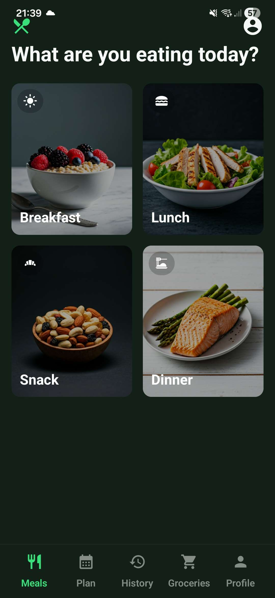
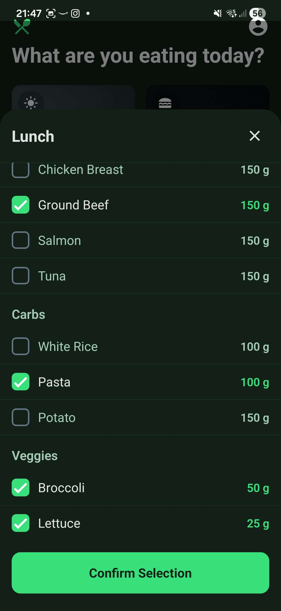
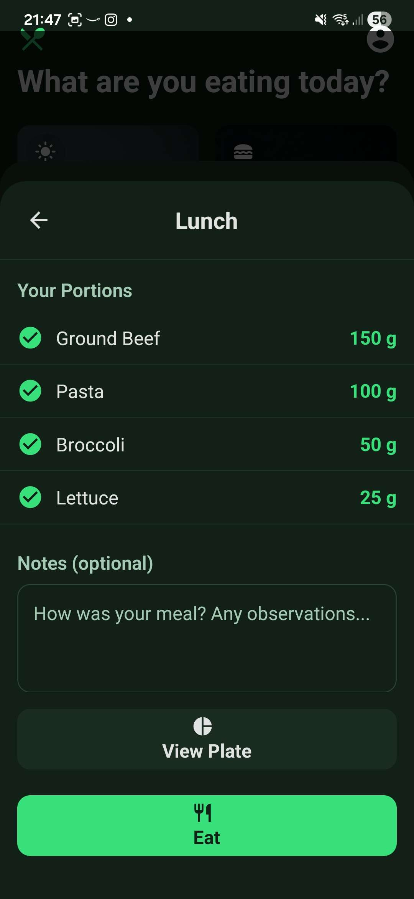
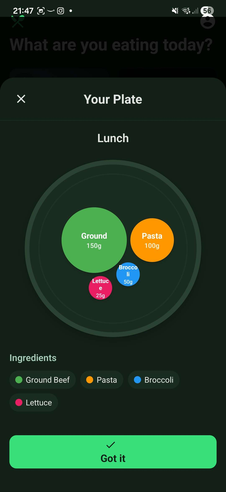
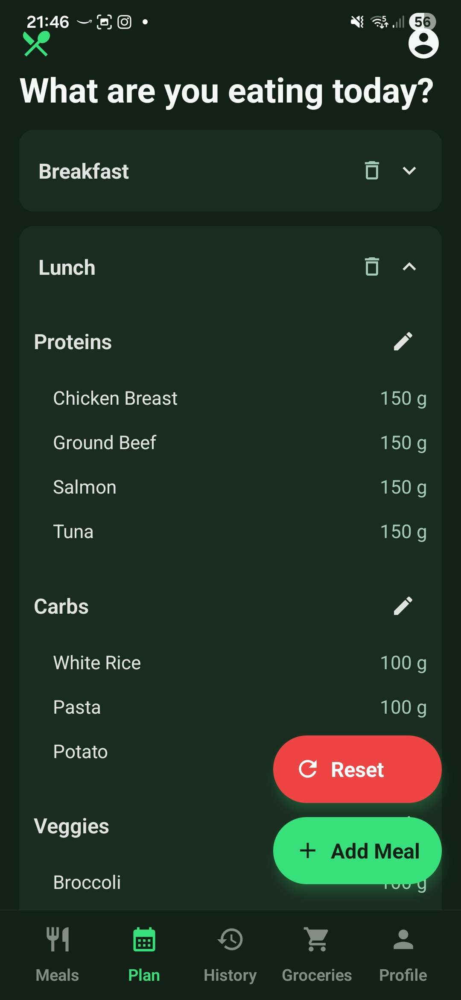
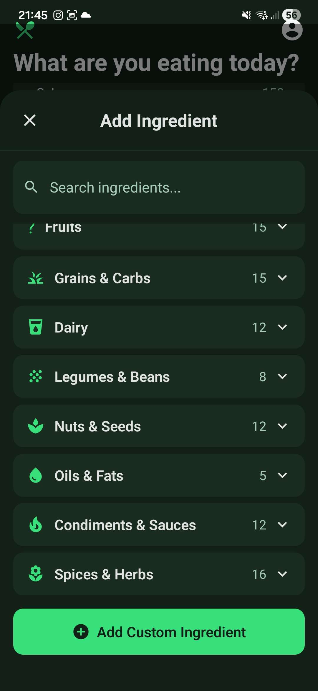
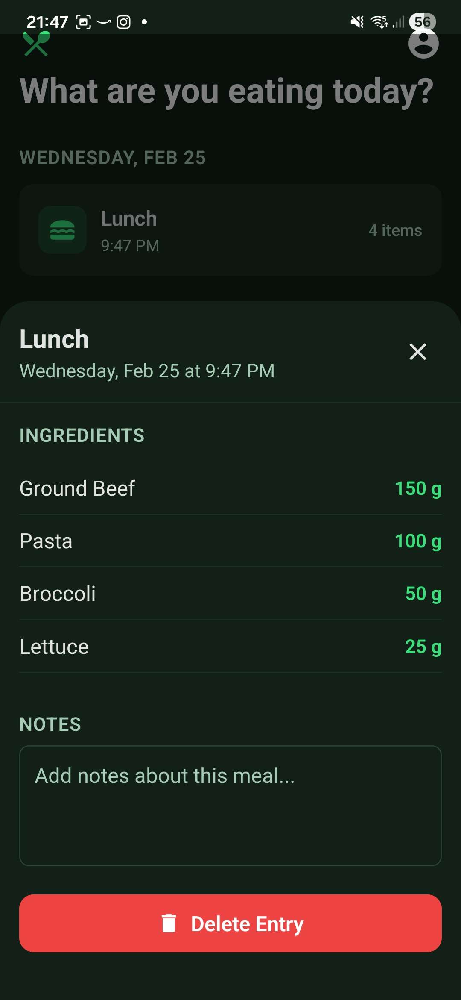
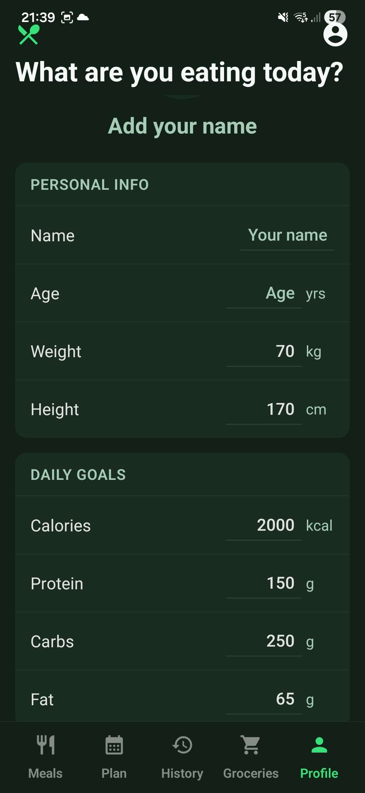

# PrepWise

> **A modern meal planning, grocery management, and nutritional tracking app built with React Native and Expo.**



---

## ✨ Features

- **Meal Planning:** Create, organize, and customize meals for breakfast, lunch, dinner, and snacks. Add ingredients with proportional quantity calculations and organize them into sections.
- **Meal Selection:** Visually select meals and ingredients from a rich database (100+ items, 9 categories). Ingredient picker supports custom quantities and units.
- **Grocery Management:** Build and manage shopping lists with item names, quantities, units, and checklist functionality. Mark items as purchased and clear completed items.
- **History Tracking:** Log consumed meals with date, meal type, ingredients, and personal notes. View historical meal data and track eating patterns.
- **User Profile:** Store and manage user information (name, age, weight, height, daily nutritional goals). Set personal targets for calories, protein, carbs, and fat.
- **Modal Panels:** Global modal management for ingredient pickers, confirmations, and overlays.
- **Persistent Storage:** All data is saved locally using AsyncStorage for offline access.

---

## 📸 Demo / Screenshots

### Home Screen
   

### Plan Screen
 

### History Screen


### Profile Screen


---

## 🚀 Installation

1. **Clone the repository:**
   ```bash
   git clone https://github.com/yourusername/MealPrep.git
   cd MealPrep
   ```
2. **Install dependencies:**
   ```bash
   npm install
   ```
3. **Start Expo development server:**
   ```bash
   npm run dev
   ```
4. **Run on device/emulator:**
   - For iOS: `npm run ios`
   - For Android: `npm run android`

---

## 🛠️ Usage

- **Meal Planning:** Navigate to the Plan tab, add meals and ingredients, organize by sections, and adjust quantities.
- **Meal Selection:** Use the Meal Selection tab to visually pick meals and log them to history.
- **Grocery Management:** Add items to your grocery list, mark as purchased, and clear completed items.
- **History Tracking:** View your meal history, add notes, and track nutritional intake.
- **Profile:** Set your personal information and nutritional goals in the Profile tab.
- **Theme:** Switch between light/dark mode or use system preference in Profile settings.

---

## 💬 Support / Donate

If you find PrepWise useful, consider starring the repo or donating to support development!

[
](https://ko-fi.com/U7U31UUWQU)

---

## 📄 License

MealPrep is released under the [MIT License](LICENSE).

- [Expo documentation](https://docs.expo.dev/): Learn fundamentals, or go into advanced topics with our [guides](https://docs.expo.dev/guides).
- [Learn Expo tutorial](https://docs.expo.dev/tutorial/introduction/): Follow a step-by-step tutorial where you'll create a project that runs on Android, iOS, and the web.

## Join the community

Join our community of developers creating universal apps.

- [Expo on GitHub](https://github.com/expo/expo): View our open source platform and contribute.
- [Discord community](https://chat.expo.dev): Chat with Expo users and ask questions.
